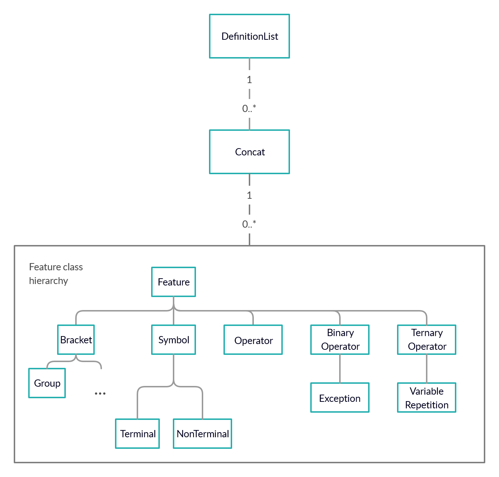

# mlangpy

A collection of tools for parsing, building and manipulating metalanguages.

## Getting started

### Prerequisites

This tool requires Python v3.6+.

### Installation

Currently, mlangpy depends on `ordered-sets` (to be removed) and `lark-parser`.

```
pip install ordered-sets
pip install lark-parser
```

`mlangpy` currently resides on Test PyPi. Install it using the command:

```
pip install --index-url https://test.pypi.org/simple --no-deps mlangpy
```


`mlangpy` relies heavily on the [Lark parser](https://github.com/lark-parser/lark "Lark parser") for its parsing facilities, so it's recommended that you familiarise yourself with it.
## Usages

### Validate Metalanguages 

Currently, mlangpy supports recognition of BNF ([ALGOL60 variant](homepages.cs.ncl.ac.uk/cliff.jones/publications/OCRd/BBG63.pdf)) EBNF ([ISO/IEC 14977](https://www.cl.cam.ac.uk/~mgk25/iso-14977.pdf)) and ABNF ([RFC 5234](https://tools.ietf.org/html/rfc5234)). You can generate parse trees for grammars using `metaparsers.py`:

```
from mlangpy.metaparsers import validate_ABNF, validate_ABNF_faithful, validate_EBNF

v = validate_ABNF('a = %x100-110 ["hi"] \n')
print(v.pretty())

# Notice this parse tree is a lot longer and more awkward to work with.
y = validate_ABNF_faithful('a = %x100-110 ["hi"] \n')
print(y.pretty())

z = validate_EBNF('''
  if clause = "if", Boolean expression, "then" ;
  Boolean expression = 'True' | 'False' ;
''')
print(z.pretty())
```

### Model grammars and grammatical features, independent of syntax

`mlangpy` includes classes for modelling all aspects of a grammars, from (non-)terminal symbols up to entire rules, with
support for defining custom operators and brackets, in `grammar.py`.

#### Class hierarchy


In short,
* A `DefList` contains 0+ `Concat` instances,
* A `Concat` contains 0+ `Feature` instances,
* A `Symbol` is a string/char corresponding to a string literal,
* A `Bracket` surrounds either a `DefList` or a `Concat`,
* An `Operator` is applied to a **single** `Feature`,
* A `BinaryOperator` is applied to **two** `Feature` instances,
* A `TernaryOperator` is applied to **three** `Feature` instances.

Some implicit consequences of these limitations:
* Precedence has to be made explicit for operators (i.e. via bracketing) since
they won't accept `Concat` or `DefList` instances as arguments.

#### Examples

Building and inspecting a rule:
```python
from mlangpy.grammar import NonTerminal, Terminal, Rule, Concat, \
    Optional, Ruleset

n = NonTerminal('name')
t1 = Terminal('A')
t2 = Terminal('dog')
o = Optional(Concat([t1]))

r = Rule(
    n,
    [Concat([
        o, t2
    ])]
)
print(r)    # /name/ -> [A] dog

print(r.left)        # /name/
print(r.right)       # [A] dog (The DefList)
print(r.right[0])    # [A] dog (The first Concat in the DefList)
print(r.right[0][0]) # [A]     (The first Feature in the Concat)
```

Loading rules into a Metalanguage instance:
```python
from mlangpy.grammar import NonTerminal, Terminal, Rule, Concat, \
    Optional, Ruleset
from mlangpy.metalanguages import Metalanguage
from copy import deepcopy

n = NonTerminal('name')
t1 = Terminal('A')
t2 = Terminal('dog')
o = Optional(Concat([t1]))

r = Rule(
    n,
    [Concat([
        o, t2
    ])]
)

ruleset = Ruleset([r])
m = Metalanguage(ruleset)
print(m.ruleset)    # /name/ -> [A] dog

r2 = deepcopy(r)
r2.left[0] = NonTerminal('x')
r2.right[0][0] = t1

m.ruleset += r2
print(m.ruleset)    # /name/ -> [A] dog
                    # /x/ -> A | dog
```

Swap to a different syntax:
```python
from mlangpy.metalanguages.EBNF import EBNFRule, EBNFNonTerminal, Metalanguage
from mlangpy.grammar import NonTerminal, Terminal, Rule, Concat, \
    Optional, Ruleset

class MyTerminal(Terminal):
    def __init__(self, subject):
        super().__init__(subject, left_bound='"', right_bound='"')


n = NonTerminal('name')
t1 = Terminal('A')
t2 = Terminal('dog')
o = Optional(Concat([t1]))

r = Rule(
    n,
    Concat([
        o, t2
    ])
)

ruleset = Ruleset([r])
m = Metalanguage(ruleset)

m.syntax[Rule] = EBNFRule
m.syntax[NonTerminal] = EBNFNonTerminal
m.syntax[Terminal] = MyTerminal
m.normalise()

print(m.ruleset)    # name = ["A"] "dog" ;
```
Classes are given for the parts of some standard metalanguages in `mlangpy.metalanguages`.

### Generate grammar models from actual syntax
Writing grammars this way in a Python file is more cumbersome than actually just writing grammars normally.
Using the Lark parser, grammars can be passed as strings and a `Ruleset` or `Metalanguage` object can be generated. 
`metaparsers.py` shows how Lark `Transformer` subclasses can be used to convert serialised grammars to objects we
can work with.

```python
from mlangpy.metaparsers import parse_BNF, parse_ABNF

bnf = parse_BNF(tests)
print(bnf.ruleset)

abnf = parse_ABNF('''
    comment =  ";" *(WSP / VCHAR) CRLF
    repeat = ;hi
        1*2DIGIT / (*DIGIT "*" *DIGIT)
    char-val =  DQUOTE *(%x20-21 / %x23-7E) DQUOTE
    repeat =/ "hi"
''')
print(abnf.ruleset)
```

It should be noted that `grammar.py` does not have facilities for comments - since comments are meta-constructs (they give
information about the grammar), they don't really fit in the model. A way that this could be implemented is by
allowing `Rule` instances to reference comment objects.

If you want to parse some other metalanguage, you'll need to write your own lark grammar, or you can let me know and I might
implement it.
